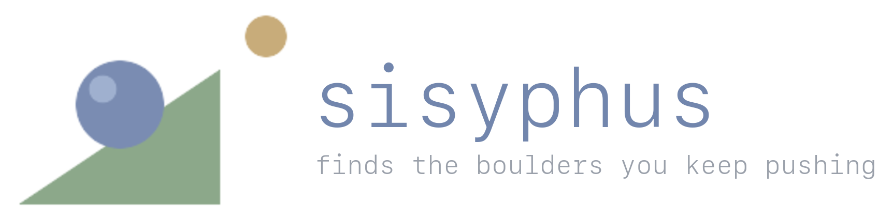
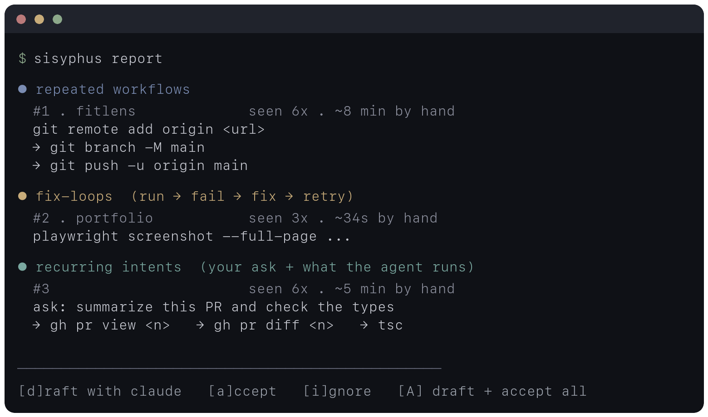
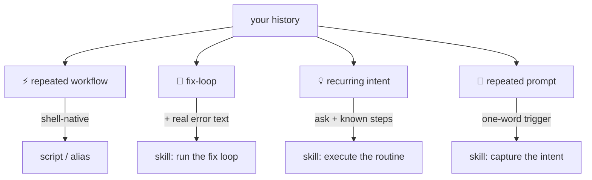
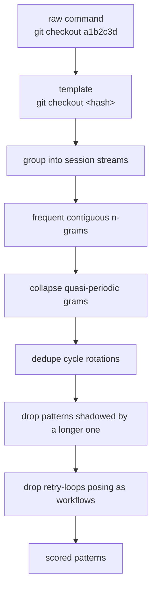
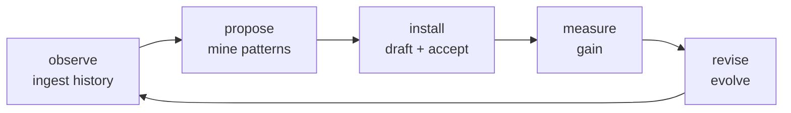
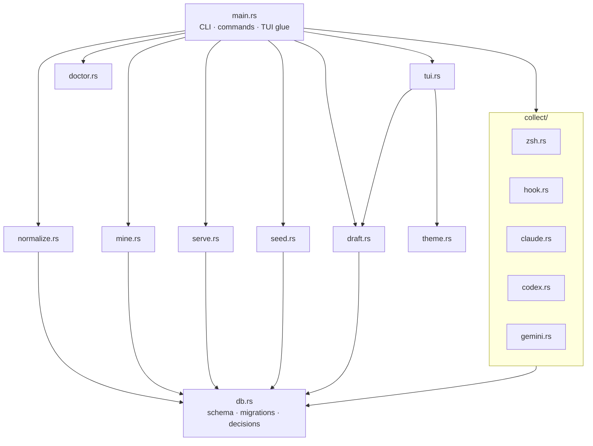
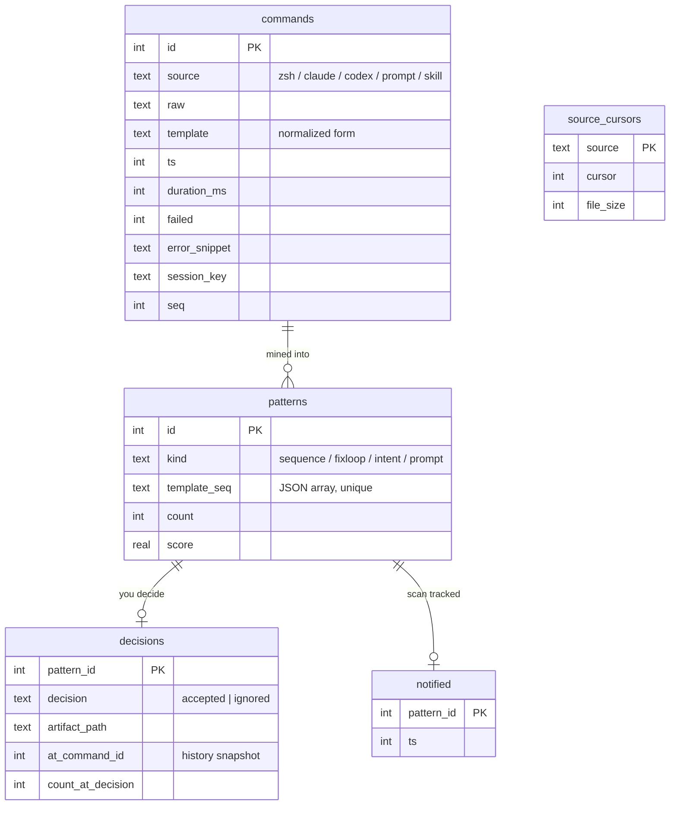

<p align="center">
  
</p>

<p align="center">
  <strong>Your work history, mined for the things you keep doing by hand — and automated.</strong><br />
  sisyphus watches your shell and your AI-agent sessions
  (<a href="https://claude.com/claude-code">Claude Code</a>, <a href="https://github.com/openai/codex">Codex</a>, Gemini),<br />
  finds the multi-step boulders you keep pushing, and uses Claude to draft the automation.
</p>

<p align="center">
  
  
  
  
  
</p>

<p align="center">
  <a href="#quickstart">Quickstart</a> ·
  <a href="#what-it-finds">What it finds</a> ·
  <a href="#how-mining-works">How it works</a> ·
  <a href="#the-feedback-loop">The loop</a> ·
  <a href="#architecture">Architecture</a>
</p>

<p align="center">
  
</p>

Everything stays on your machine. History is ingested into a local SQLite
database; the only network call is a single `claude -p` invocation, and only
when *you* ask for a draft. Then sisyphus watches whether each automation
actually *stuck* — and revises it if it didn't.

---

## Contents

- [Why](#why)
- [The pipeline](#the-pipeline)
- [Quickstart](#quickstart)
- [What it finds](#what-it-finds)
- [Commands](#commands)
- [Sources](#sources)
- [How mining works](#how-mining-works)
- [The feedback loop](#the-feedback-loop)
- [Architecture](#architecture)
- [Data model](#data-model)
- [Configuration](#configuration)
- [Development](#development)
- [Design principles](#design-principles)

---

## Why

The agent/orchestrator space is crowded, but almost nothing learns from *how you
personally work*. sisyphus does one narrow thing well: it notices the repetitive
boulder-pushing in your own history and turns it into automation you'll actually
use — a shell script, an alias, or (for agent-native users) a Claude Code skill
you trigger with one word.

It is deliberately **local-first** and **deterministic-first**: all mining is
plain algorithms over a local database, so it's cheap enough to run continuously.
An LLM enters the picture only at the moment of drafting, when there's real value
in judgment.

## The pipeline

```mermaid
flowchart LR
    subgraph SRC[Sources]
        Z[zsh hook / HISTFILE]
        C[Claude Code]
        X[Codex]
        G[Gemini CLI]
    end

    SRC --> COL[Collectors<br/>incremental cursors]
    COL --> CMD[(commands)]
    CMD --> NRM[Normalizer<br/>cmd → template]
    NRM --> MIN[Miner<br/>4 pattern kinds]
    MIN --> PAT[(patterns)]
    PAT --> REP[report / TUI]

    REP -->|you choose to draft| DRF[Drafter<br/>claude -p]
    DRF --> INS[Install<br/>script · alias · skill]
    INS --> DEC[(decisions)]

    DEC --> GN[gain / evolve<br/>measure adoption]
    GN -. revise / resurface .-> REP

    style DRF fill:#7a8cb2,color:#fff
    style MIN fill:#8ca88a,color:#fff
```



Everything left of the drafter is deterministic and LLM-free. The blue box
(`claude -p`) is the only place a model is called; the green box (the miner) is
pure algorithms and runs on every scan.

## Quickstart

```sh
# 1. Build & install (needs the `claude` CLI on PATH for drafting)
cargo install --path .

# 2. Agent-native? Install the shell hook for richer data (exit codes, timing)
echo 'eval "$(sisyphus hook zsh)"' >> ~/.zshrc

# 3. Verify the setup
sisyphus doctor

# 4. Pull in history and review what it found
sisyphus ingest
sisyphus report

# 5. (optional) Let it watch in the background, and see the dashboard
sisyphus watch --install
sisyphus serve
```

No history to work with yet? Jump to [Development](#development) — `sisyphus seed`
generates weeks of realistic synthetic history against a throwaway database.

## What it finds

Four kinds of "boulder", each surfaced in its own section of `report` and
drafted differently:



| Kind | Signal | Drafted as |
|------|--------|------------|
| **⚡ Repeated workflow** | A frequent multi-step command sequence (`git pull → build → deploy → healthcheck`). | Shell **script** or **alias**. |
| **🔁 Fix-loop** | The same command re-run after failures inside an agent session — an execute→fail→fix→retry cycle done by hand. The first 300 chars of the real error are captured too. | A **skill** that runs the whole loop, with the actual error text as context. |
| **💡 Recurring intent** | The deepest AI-side signal: a prompt you keep sending **fused with** the command routine the agent runs every time (`"summarize this PR…"` → `gh pr view` → `gh pr diff` → `tsc`). | A **skill** with the known steps encoded, so the agent stops rediscovering them each session. |
| **💬 Repeated prompt** | Near-duplicate requests you keep typing to Claude/Codex/Gemini, clustered by similarity, with no consistent routine *yet*. | A **skill** that makes the intent a one-word command. |

For **agent-native users** (whose shell is basically `ls` / `yazi` / `claude` /
`codex`), sisyphus detects that all real work happens inside agents and biases
every draft toward Claude Code skills rather than shell scripts. It also counts
skill invocations from transcripts as usage, so `gain` and `evolve` don't
misjudge an adopted skill as unused. Force the behaviour with
`[draft] prefer = "skill"` in the config.

## Commands

| Command | What it does |
|---------|--------------|
| `sisyphus ingest` | Incrementally pull new history from all sources into the DB. |
| `sisyphus stats` | Summary of what's been ingested plus the top command templates. |
| `sisyphus report` | Full-screen TUI: browse patterns, draft with Claude, accept/ignore. |
| `sisyphus report --auto` | Draft **every** undecided pattern in parallel and install each draft. |
| `sisyphus report --plain` | Line-by-line output instead of the TUI (also used when piped). |
| `sisyphus report --project <name>` | Only patterns from repos whose name contains the substring. |
| `sisyphus report --json` | Emit mined patterns as JSON instead of drafting. |
| `sisyphus report --semantic` | Cluster prompts by meaning via one `claude` call (opt-in). |
| `sisyphus digest` | Glanceable summary: friction by repo, top boulders, adoption. |
| `sisyphus gain` | Adoption + skill-impact: does the agent do less after a skill? |
| `sisyphus completions <shell>` | Print a shell completion script (zsh/bash/fish/…). |
| `sisyphus draft <id>` | Draft one pattern non-interactively and print it (no install). |
| `sisyphus gain` | Report whether accepted automations are actually being used. |
| `sisyphus evolve` | Act on adoption feedback: revise unused artifacts, resurface ignored patterns. |
| `sisyphus serve` | Local web dashboard at `http://127.0.0.1:5757`. |
| `sisyphus doctor` | Check the setup (claude on PATH, hook, `EXTENDED_HISTORY`, watch, ingestion). |
| `sisyphus hook zsh` | Print the shell hook to `eval` from `~/.zshrc`. |
| `sisyphus watch --install` | Install an hourly background scan (launchd) with notifications. |
| `sisyphus seed --days N` | Fill an alternate DB with synthetic history (dev/demo only). |

Global flag: `--db <path>` (or `SISYPHUS_DB=<path>`) points any command at an
alternate database.

### The TUI

`report` opens a two-pane browser:

```
┌ sisyphus — boulders ──────┐┌──────────────────────────────────┐
│ ● ⚡ git remote add   6×   ││ ⚡ sequence   seen 6× · score 12  │
│ ○ 🔁 cargo build     47×   ││                                  │
│ ● 💡 ask: summarize… 6×    ││    git remote add origin <path>  │
│ ○ 💬 write release … 4×    ││  → git branch -M main            │
│                           ││  → git push -u origin main       │
│                           ││  ──────────────────────────────  │
│                           ││  git-publish (script) — connect… │
└───────────────────────────┘└──────────────────────────────────┘
 j/k move · d draft · a accept · i ignore · A draft+accept ALL · q quit
```

- `j`/`k` — move; `d` — draft the selected pattern (up to 3 `claude` workers run
  concurrently in the background, so the UI never blocks); `a` — install; `i` —
  ignore forever; `A` — draft **and** install everything; `q` — quit.
- The state dot shows each pattern's lifecycle: `○` idle → `◐` drafting → `●`
  drafted → `✓` done / `✗` failed.

## Sources

| Source | Location | What's extracted |
|--------|----------|------------------|
| **zsh hook** | `eval "$(sisyphus hook zsh)"` in `~/.zshrc` | commands + timestamp, duration, exit code, cwd — the richest source; supersedes HISTFILE once active |
| **zsh** | `~/.zsh_history` | commands (+ timestamps if `EXTENDED_HISTORY` is set) |
| **Claude Code** | `~/.claude/projects/*/*.jsonl` | Bash tool calls, prompts, Skill invocations, tool-result errors |
| **Codex** | `~/.codex/sessions/**/rollout-*.jsonl` | exec/shell calls, prompts, failure output |
| **Gemini CLI** | `~/.gemini/tmp/*/logs.json` | prompts |

Ingestion is **incremental** — each source keeps a cursor (byte offset for
files, line count for transcripts), so re-running only reads what's new.

## How mining works

Mining is a deterministic pipeline. No LLM is involved until you ask for a draft.



1. **Normalize.** Each command becomes a template: variable arguments (paths,
   URLs, hashes, versions, bare numbers) collapse to placeholders like `<path>`
   and `<hash>`, so `git checkout a1b2c3d` and `git checkout f9e8d7c` count as the
   same step.
2. **Sequence mining** finds frequent contiguous n-grams within each session
   stream, then applies four honesty filters: quasi-periodic grams collapse to
   their repeating unit (`A→B→A→B` is one loop, not four patterns), rotations of a
   cycle are deduplicated, a pattern shadowed by a longer one with the same
   support is dropped, and grams where one step repeats 3+ times are handed off to
   fix-loop detection instead.
3. **Fix-loop detection** flags commands re-run 3+ times with 2+ failures in a
   single session. Failures come from Claude tool-result `is_error` flags and
   Codex output heuristics; the error text is stored for drafting.
4. **Prompt clustering** groups near-duplicate prompts by Jaccard similarity over
   word sets (stopwords and interchangeable verbs like *write/generate/draft*
   stripped so paraphrases merge). `--semantic` swaps this for one `claude` call
   that groups by meaning — catching paraphrases that share no words, even across
   languages — at the cost of sending your prompts to claude (hence opt-in).
5. **Intent mining** fuses each prompt cluster with the commands the agent ran
   between that prompt and the next one; steps present in ≥60% of instances become
   the intent's known routine.

Accepted artifacts install to `~/.local/bin/` (scripts),
`~/.config/sisyphus/aliases.zsh` (aliases), or `~/.claude/skills/` (skills).

## The feedback loop

sisyphus doesn't stop at "here's a suggestion". Every decision snapshots where
your history stood at that moment, so the tool can later see what happened
*after* — and act on it.



`sisyphus evolve` handles two failure modes:

- **Accepted but not adopted** — you installed `git-publish` yet did the manual
  dance 4 more times without ever invoking it. evolve feeds the artifact *plus the
  post-install evidence* back to Claude to diagnose the mismatch (wrong args?
  unmemorable name? missing step?) and revises it in place — or retires it and
  reopens the pattern.
- **Ignored but still growing** — a pattern you dismissed that kept happening
  gets resurfaced with evidence, one keypress to reopen.

The hourly `watch` scan sends a notification about both new high-value patterns
and automations that aren't sticking.

## Architecture

Single Rust binary, one module per responsibility:



| Module | Responsibility |
|--------|----------------|
| `main.rs` | CLI parsing, command dispatch, `report`/`gain`/`evolve` orchestration. |
| `collect/*` | One collector per source; incremental, cursor-based ingest. |
| `normalize.rs` | Command → template normalization. |
| `mine.rs` | The four pattern miners plus the shared candidate ranking. |
| `draft.rs` | `claude -p` prompt construction, artifact parsing, install, revision. |
| `tui.rs` | ratatui two-pane browser with background draft workers. |
| `serve.rs` | Dependency-free HTTP server for the dashboard. |
| `theme.rs` | Palette + config-file theming. |
| `doctor.rs` | Setup health checks. |
| `seed.rs` | Synthetic history generator (also backs the e2e test). |
| `db.rs` | Schema, migrations, and the shared `decide` / `artifact_uses` helpers. |

## Data model



The `at_command_id` snapshot on `decisions` is what makes the feedback loop work:
`evolve` counts how many times a pattern recurred, and how often its artifact was
used, *only since the decision was made*.

## Configuration

`~/.config/sisyphus/config.toml`:

```toml
theme = "muted"          # "muted" (default, low-saturation) or "terminal" (ANSI)

[colors]                 # any subset, hex — overrides the base theme
accent  = "#7a8cb2"      # slate
ok      = "#8ca88a"      # sage
warn    = "#c8ac7a"      # sand
err     = "#ba7a7a"      # dusty rose
intent  = "#7aa8a0"      # muted teal
prompt  = "#9e8cb2"      # dusty lavender

[draft]
prefer = "skill"         # "auto" (detect), "skill", or "script"

[skills]
commit = true            # after accepting an artifact, git-commit it to the
                         # repo that contains it (e.g. a dotfiles repo tracking
                         # ~/.claude/skills), with a conventional message
```

The dashboard (`sisyphus serve`) uses the same palette: stat tiles, a
commands-per-day chart, top templates, per-artifact gain, and the full pattern
ledger — all from one self-contained page with no external requests.

## Development

```sh
cargo build            # debug build
cargo test             # 24 tests, including an end-to-end mining test
cargo clippy           # lints (kept clean)
```

**Developing without real history.** Don't have weeks of history lying around —
or between machines? Seed a synthetic one against a throwaway database:

```sh
sisyphus --db /tmp/demo.db seed          # 21 days of plausible dev history
sisyphus --db /tmp/demo.db report        # full TUI against it
sisyphus --db /tmp/demo.db serve         # dashboard with real-looking charts
```

`seed` refuses to touch the real default database. The same generator backs the
end-to-end test (`seed::tests::miner_finds_planted_patterns`), which plants one
of every pattern kind and asserts the miner recovers them — so mining changes
have regression coverage without depending on any real history.

## Design principles

- **Local-first.** History never leaves your machine; the DB lives under your
  data dir. The only network call is `claude -p`, only at draft time.
- **Deterministic-first.** All mining is plain algorithms, cheap enough to run
  hourly. The LLM is reserved for the one step — drafting — where judgment pays.
- **Close the loop.** A suggestion nobody adopts is noise. sisyphus measures
  adoption and revises, rather than firing recommendations into the void.
- **Meet you where you work.** Shell-native or agent-native, the artifact kind
  adapts — and skill usage inside agents counts just like a shell command.

## License

[MIT](LICENSE) © 2026 Wendy Pan

---

*Requires the [`claude`](https://claude.com/claude-code) CLI on PATH for drafting.
Built in Rust; macOS-first (launchd, `osascript` notifications), Linux-friendly
for everything except the ambient scan.*
